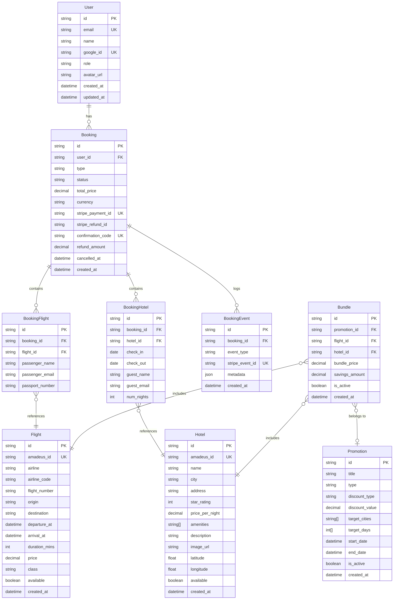
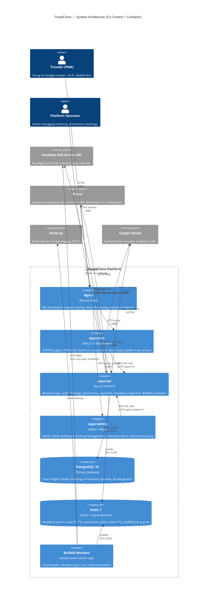
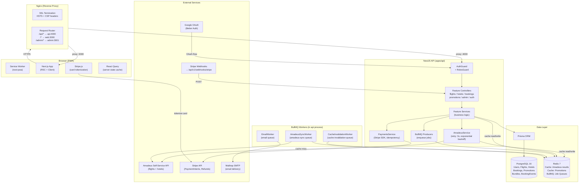

# Architecture Decision Document — TravelClone

**Author:** Phuc
**Date:** 2026-04-01
**Status:** Final
**Domain:** Travel Booking PWA — Greenfield MVP

---

## 1. Project Context Analysis

### 1.1 Functional Requirements Coverage (50 FRs across 10 capability areas)

| Capability Area | FR IDs | Count | Primary Architectural Component |
|---|---|---|---|
| User Discovery & Promotions | FR1–FR6 | 6 | Next.js RSC + Promotion API + Redis TTL 15min |
| Budget-First Discovery | FR7–FR9 | 3 | PostgreSQL SQL query + NestJS BudgetModule |
| Flight Booking | FR10–FR14 | 5 | Amadeus API + FlightsModule + BookingModule |
| Hotel Booking | FR15–FR18 | 4 | Amadeus API + HotelsModule + BookingModule |
| Bundle Booking | FR19–FR21 | 3 | BundlesModule + admin-curated Prisma records |
| Payment & Checkout | FR22–FR25 | 4 | Stripe.js (client) + PaymentsModule (server) |
| Post-Booking Management | FR26–FR32 | 7 | BookingsModule + BullMQ email worker |
| User Accounts & Auth | FR33–FR36 | 4 | Better Auth + Google OAuth + UsersModule |
| Admin Dashboard | FR37–FR46 | 10 | apps/admin (Refine) + AdminModule (NestJS) |
| Data & Search | FR47–FR50 | 4 | Amadeus API + Redis + PostgreSQL FTS |

### 1.2 Non-Functional Requirements Mapping (23 NFRs)

| NFR | Category | Architectural Resolution |
|---|---|---|
| NFR1: FCP < 1.5s | Performance | Next.js RSC + Redis cache for promotions (15min TTL) + CDN static assets |
| NFR2: Search < 500ms p95 | Performance | Redis cache hit for Amadeus results (1h TTL); cache-aside pattern |
| NFR3: Page transitions < 300ms | Performance | Next.js App Router client navigation + React Query prefetch |
| NFR4: Budget discovery < 3s | Performance | Indexed PostgreSQL query on flights/hotels tables |
| NFR5: Lighthouse 90+ | Performance | next/image, next-pwa, Tailwind purge, RSC default |
| NFR6: HTTPS/TLS 1.2+ | Security | Nginx SSL termination; HSTS header |
| NFR7: httpOnly cookies | Security | Better Auth refresh tokens in httpOnly, Secure, SameSite=Strict cookies |
| NFR8: Stripe.js tokenization | Security | Card data never touches NestJS — Stripe Elements client-side only |
| NFR9: Admin RBAC | Security | Better Auth role:admin check; separate /admin route guard |
| NFR10: Input validation | Security | class-validator (NestJS DTOs) + Zod (Next.js server actions) |
| NFR11: Rate limiting auth | Security | @nestjs/throttler 10 req/min/IP on /auth/* endpoints |
| NFR12: 100 concurrent users | Scalability | Single Docker Compose sufficient; Nginx worker_connections 1024 |
| NFR13: 90%+ cache hit rate | Scalability | Redis cache-aside; BullMQ cron refreshes stale entries |
| NFR14: Read replica ready | Scalability | Prisma datasource supports multiple URLs; schema has no circular FKs |
| NFR15: K8s-migratable | Scalability | Docker Compose services map 1:1 to K8s Deployments; no host-level coupling |
| NFR16: WCAG 2.1 AA | Accessibility | shadcn/ui headless primitives (Radix UI); aria-* on all custom components |
| NFR17: Keyboard navigable | Accessibility | Radix UI focus management; tabIndex discipline |
| NFR18: Color contrast AA | Accessibility | Design tokens validated: #0064D2 on #FFFFFF = 7.2:1; #FF6B00 on white = 3.1:1 (large text only) |
| NFR19: Alt text | Accessibility | next/image requires alt prop; ESLint jsx-a11y enforced |
| NFR20: Amadeus retry | Integration | Axios interceptor: 3 retries, exponential backoff (1s, 2s, 4s) |
| NFR21: Stripe webhook idempotency | Integration | Stripe event ID stored in BookingEvents; duplicate check before processing |
| NFR22: Mailtrap + React Email | Integration | BullMQ email worker + @react-email/components templates |
| NFR23: Better Auth token refresh | Integration | Better Auth SDK handles silent refresh; access token 15min, refresh 7d |

### 1.3 Complexity Assessment

- **Complexity:** Medium — 8 integrated subsystems (auth, payments, external API, cache, async jobs, admin, search, PWA), no regulatory hurdles for internal MVP (ATAS/PCI-DSS deferred to public launch)
- **Primary domain:** Full-stack web application (PWA) — Next.js SSR + NestJS REST API
- **Cross-cutting concerns:**
  - **Auth:** Better Auth session propagated via httpOnly cookie; NestJS `AuthGuard` on protected routes; admin role checked via `RolesGuard`
  - **Caching:** Redis cache-aside on all Amadeus API calls; cache invalidated on admin data updates
  - **Error handling:** NestJS global `HttpExceptionFilter` → standardized `ApiResponse` envelope; React Error Boundaries per route segment
  - **Logging:** Pino structured JSON (NestJS); `request-id` header propagated for log correlation; Next.js `console` structured to stdout
  - **Promotion engine:** Rule evaluation at request time: geolocation match (city), time match (day/season/holiday), browsing history (localStorage for anon, Postgres for logged-in)

---

## 2. Starter Template & Initialization

### 2.1 Monorepo Structure (Turborepo)

```
TravelClone monorepo
├── apps/
│   ├── web          — Next.js 15 App Router (PWA frontend)
│   ├── api          — NestJS 10 (REST API backend)
│   └── admin        — Refine + React (admin dashboard)
├── packages/
│   ├── shared       — TypeScript types, constants, utils (consumed by all apps)
│   ├── database     — Prisma schema, migrations, seed scripts
│   ├── eslint-config — Shared ESLint rules (extends eslint-config-next + nestjs)
│   └── tsconfig     — Shared tsconfig base files
```

### 2.2 Initialization

```bash
# Bootstrap Turborepo monorepo
npx create-turbo@latest travelclone --package-manager pnpm

# Add apps
cd travelclone
pnpm dlx create-next-app@15 apps/web --typescript --tailwind --app --src-dir --import-alias "@/*"
pnpm dlx @nestjs/cli new apps/api --package-manager pnpm
pnpm create refine-app@latest apps/admin -- --preset refine-nextjs

# Add packages
mkdir -p packages/{shared,database,eslint-config,tsconfig}
pnpm add -w prisma @prisma/client
pnpm add -w turbo
```

**Rationale for Turborepo:** Single repo enables type-safe imports across `apps/web`, `apps/api`, `apps/admin` via `packages/shared` without npm publish cycle. `turbo build` parallelizes all builds; `turbo dev` hot-reloads all services. Remote cache (Vercel/self-hosted) cuts CI build time 60%+.

### 2.3 What Starter Provides vs What We Build

| Provided by Starter | We Build |
|---|---|
| Next.js App Router scaffold | All pages, components, layouts |
| NestJS app shell + DI container | All modules, services, controllers |
| Refine CRUD scaffold | Customized resources, auth provider |
| Turborepo pipeline config | Per-package build scripts, env handling |
| Tailwind base config | Design system tokens, component variants |
| Prisma CLI | Full schema, all migrations, seed data |

---

## 3. Core Architectural Decisions

### 3.1 Data Architecture

#### 3.1.1 PostgreSQL via Prisma ORM

- **Database:** PostgreSQL 16 (Docker image `postgres:16-alpine`)
- **ORM:** Prisma 5 — type-safe query builder, migration engine, seed runner
- **Connection:** Prisma Client singleton in `packages/database/src/client.ts`; imported by `apps/api` only
- **Migration strategy:**
  - `prisma migrate dev` — development (auto-applies + generates client)
  - `prisma migrate deploy` — production (applies pending migrations only, no destructive auto-reset)
  - Migrations stored in `packages/database/prisma/migrations/` and committed to git
  - Schema changes follow: add-only in MVP (no destructive column drops until post-launch)
- **Connection pooling:** PgBouncer not needed at MVP scale (100 concurrent users); Prisma connection pool default (10 connections) sufficient

#### 3.1.2 Redis Caching Strategy

- **Redis:** Redis 7 (Docker image `redis:7-alpine`)
- **Client:** `ioredis` in NestJS; injected via `CacheModule` (custom wrapper, not `@nestjs/cache-manager` to avoid abstraction overhead)
- **Cache patterns:**

| Cache Key Pattern | TTL | Invalidation Trigger |
|---|---|---|
| `amadeus:flights:{origin}:{dest}:{date}:{pax}` | 3600s (1h) | BullMQ cron job every 30min for popular routes |
| `amadeus:hotels:{city}:{checkin}:{checkout}:{guests}` | 3600s (1h) | BullMQ cron job every hour |
| `promotions:active:{city}:{dayOfWeek}` | 900s (15min) | Admin promotion update triggers `DEL` |
| `budget:discovery:{origin}:{budget}` | 1800s (30min) | Cleared on flight/hotel price update |
| `session:{userId}` | 86400s (24h) | Logout / Better Auth session revocation |

- **Cache-aside pattern:** NestJS service checks Redis → if miss, calls Amadeus API → stores result → returns data
- **Redis eviction policy:** `allkeys-lru` (evict least-recently-used keys when memory full)

#### 3.1.3 Database Schema Overview

See Section 6 for full Prisma schema and ER diagram.

Core tables and their primary responsibilities:

| Table | Responsibility |
|---|---|
| `users` | Auth identity, profile, role |
| `flights` | Amadeus-sourced flight inventory |
| `hotels` | Amadeus-sourced hotel inventory |
| `bookings` | Central booking record (flight/hotel/bundle) |
| `booking_flights` | Passenger details per flight booking |
| `booking_hotels` | Guest details per hotel booking |
| `promotions` | Admin-curated deals with targeting rules |
| `bundles` | Flight+hotel combo deals with pricing |
| `booking_events` | Audit log of booking state transitions (Stripe event IDs for idempotency) |

---

### 3.2 Authentication & Security

#### 3.2.1 Better Auth Configuration

```typescript
// apps/api/src/auth/better-auth.config.ts
export const authConfig = {
  providers: [googleOAuth({ clientId, clientSecret })],
  session: {
    accessTokenExpiresIn: 60 * 15,        // 15 minutes
    refreshTokenExpiresIn: 60 * 60 * 24 * 7, // 7 days
    cookieOptions: {
      httpOnly: true,
      secure: true,
      sameSite: 'strict',
      path: '/',
    },
  },
  callbacks: {
    onCreateUser: async (user) => prisma.user.create({ data: { ...user, role: 'user' } }),
    onSignIn: async ({ user }) => ({ role: user.role }),
  },
};
```

#### 3.2.2 Role-Based Access Control

| Role | Access |
|---|---|
| `user` | Own bookings, profile, public search/promotions |
| `admin` | All user data, CRUD inventory/promotions, booking management, refunds |

- NestJS `RolesGuard` + `@Roles('admin')` decorator on admin controllers
- Admin routes prefixed `/api/v1/admin/*`; separate auth check via `AdminAuthGuard`
- Admin dashboard (apps/admin) authenticates against same Better Auth endpoint; role checked on API side

#### 3.2.3 Security Controls

| Control | Implementation |
|---|---|
| Rate limiting | `@nestjs/throttler` — 10 req/min/IP on `/api/v1/auth/*` |
| Input validation | `class-validator` + `class-transformer` on all NestJS DTOs; `ValidationPipe({ whitelist: true, forbidNonWhitelisted: true })` global |
| SQL injection | Prisma parameterized queries — no raw SQL in application code |
| XSS | React DOM escaping by default; CSP headers via Nginx |
| CSRF | Better Auth CSRF tokens on state-changing requests; SameSite=Strict cookies |
| PCI compliance | Stripe.js client-side tokenization; card data never reaches NestJS |
| HTTPS | Nginx TLS termination; HSTS: `Strict-Transport-Security: max-age=31536000` |

---

### 3.3 API & Communication

#### 3.3.1 REST API Design

- **No GraphQL** — REST is sufficient for MVP; reduces complexity; easier admin dashboard integration
- **Versioning:** `/api/v1/` prefix on all routes; breaking changes get `/api/v2/`
- **API response envelope:**

```typescript
// packages/shared/src/types/api-response.ts
export interface ApiResponse<T = unknown> {
  success: boolean;
  data?: T;
  error?: {
    code: ErrorCode;
    message: string;
    details?: unknown;
  };
  meta?: {
    page?: number;
    total?: number;
    limit?: number;
    cursor?: string;
  };
}
```

- **Standard error codes enum:**

```typescript
// packages/shared/src/constants/error-codes.ts
export enum ErrorCode {
  // Auth
  UNAUTHORIZED = 'UNAUTHORIZED',
  FORBIDDEN = 'FORBIDDEN',
  INVALID_CREDENTIALS = 'INVALID_CREDENTIALS',
  SESSION_EXPIRED = 'SESSION_EXPIRED',

  // Booking
  BOOKING_NOT_FOUND = 'BOOKING_NOT_FOUND',
  BOOKING_ALREADY_CANCELLED = 'BOOKING_ALREADY_CANCELLED',
  BOOKING_CANCELLATION_WINDOW_EXPIRED = 'BOOKING_CANCELLATION_WINDOW_EXPIRED',

  // Payment
  PAYMENT_FAILED = 'PAYMENT_FAILED',
  PAYMENT_ALREADY_PROCESSED = 'PAYMENT_ALREADY_PROCESSED',
  STRIPE_WEBHOOK_INVALID = 'STRIPE_WEBHOOK_INVALID',

  // Inventory
  FLIGHT_NOT_FOUND = 'FLIGHT_NOT_FOUND',
  HOTEL_NOT_FOUND = 'HOTEL_NOT_FOUND',
  BUNDLE_NOT_FOUND = 'BUNDLE_NOT_FOUND',
  PROMOTION_NOT_FOUND = 'PROMOTION_NOT_FOUND',

  // External
  AMADEUS_API_ERROR = 'AMADEUS_API_ERROR',
  AMADEUS_RATE_LIMIT = 'AMADEUS_RATE_LIMIT',

  // Validation
  VALIDATION_ERROR = 'VALIDATION_ERROR',
  INVALID_DATE_RANGE = 'INVALID_DATE_RANGE',
  BUDGET_TOO_LOW = 'BUDGET_TOO_LOW',

  // Generic
  INTERNAL_SERVER_ERROR = 'INTERNAL_SERVER_ERROR',
  NOT_FOUND = 'NOT_FOUND',
}
```

#### 3.3.2 NestJS Global Exception Filter

```typescript
// apps/api/src/filters/http-exception.filter.ts
@Catch()
export class GlobalExceptionFilter implements ExceptionFilter {
  catch(exception: unknown, host: ArgumentsHost) {
    const ctx = host.switchToHttp();
    const response = ctx.getResponse<Response>();
    const request = ctx.getRequest<Request>();

    const status = exception instanceof HttpException
      ? exception.getStatus()
      : HttpStatus.INTERNAL_SERVER_ERROR;

    const errorCode = exception instanceof AppException
      ? exception.errorCode
      : ErrorCode.INTERNAL_SERVER_ERROR;

    response.status(status).json({
      success: false,
      error: { code: errorCode, message: exception.message },
    } satisfies ApiResponse);
  }
}
```

#### 3.3.3 Async Job Queue (BullMQ)

| Queue | Job | Trigger | Worker |
|---|---|---|---|
| `email` | `send-booking-confirmation` | Stripe payment_intent.succeeded webhook | EmailWorker |
| `email` | `send-cancellation-confirmation` | Booking status → cancelled | EmailWorker |
| `email` | `resend-confirmation` | Admin action | EmailWorker |
| `amadeus-sync` | `sync-flight-prices` | Cron: every 30min | AmadeusSyncWorker |
| `amadeus-sync` | `sync-hotel-prices` | Cron: every 60min | AmadeusSyncWorker |
| `cache-invalidation` | `invalidate-promotion-cache` | Admin promotion update | CacheWorker |

- **BullMQ config:** Redis connection shared with main cache; separate DB index (Redis DB 1 for BullMQ, DB 0 for cache)
- **Retry policy:** 3 attempts, exponential backoff starting at 1000ms; failed jobs moved to dead letter queue after 3 failures; PagerDuty alert on dead letter (post-MVP)
- **Email templates:** React Email components in `apps/api/src/email/templates/`; rendered to HTML via `@react-email/render` in the worker

---

### 3.4 Frontend Architecture

#### 3.4.1 Next.js App Router Strategy

| Route Segment | Rendering | Rationale |
|---|---|---|
| `/` (Homepage) | RSC (Server Component) | Promotions fetched server-side; optimal FCP |
| `/flights` | RSC + Client boundary for filters | Initial results SSR; filter interaction client-side |
| `/hotels` | RSC + Client boundary for filters | Same as flights |
| `/budget-discovery` | Client Component | Interactive form; no SEO value |
| `/booking/[step]` | Client Component | Multi-step form state; auth required |
| `/my-bookings` | RSC (protected) | Static list from API; auth required |
| `/my-bookings/[id]` | RSC (protected) | Booking detail; auth required |
| `/auth/signin` | Client Component | OAuth redirect handling |

#### 3.4.2 State Management

| State Type | Solution | Scope |
|---|---|---|
| Server data (flights, hotels, bookings) | TanStack Query v5 (React Query) | Global cache |
| Booking flow form state | React Hook Form + Zod | Component tree |
| Booking step progression | React Context (`BookingFlowContext`) | Booking route segment |
| UI state (modal open, filter panel) | `useState` / `useReducer` | Local component |
| User geolocation | `useState` + `navigator.geolocation` | Homepage component |
| Auth session | Better Auth React SDK | Global (layout) |

- **React Query config:**
  - `staleTime`: 300000 (5min) for flight/hotel data
  - `gcTime`: 600000 (10min)
  - Optimistic updates for booking status changes
  - `queryKey` factory in `packages/shared/src/query-keys.ts`

#### 3.4.3 PWA Configuration

```javascript
// apps/web/next.config.js
const withPWA = require('next-pwa')({
  dest: 'public',
  register: true,
  skipWaiting: true,
  disable: process.env.NODE_ENV === 'development',
  runtimeCaching: [
    { urlPattern: /^https:\/\/api\.travelclone\.com\/api\/v1\/promotions/, handler: 'StaleWhileRevalidate', options: { cacheName: 'promotions-cache', expiration: { maxAgeSeconds: 900 } } },
    { urlPattern: /\.(png|jpg|jpeg|webp|svg)$/, handler: 'CacheFirst', options: { cacheName: 'image-cache', expiration: { maxEntries: 100, maxAgeSeconds: 86400 } } },
  ],
});
```

- **App shell:** Layout (`apps/web/src/app/layout.tsx`) is the cached shell; all nav/header/footer cached by service worker
- **Install prompt:** Shown after first successful booking or on 3rd visit (tracked in `localStorage`)
- **Manifest:** `apps/web/public/manifest.json` — `theme_color: #0064D2`, `background_color: #F8FAFC`, `display: standalone`

#### 3.4.4 Design System

- **Component library:** shadcn/ui (Radix UI primitives + Tailwind CSS)
- **Custom design tokens** via `tailwind.config.ts`:

```typescript
// apps/web/tailwind.config.ts
theme: {
  extend: {
    colors: {
      primary: { 50: '#EFF6FF', 100: '#DBEAFE', 500: '#2980E8', 600: '#0064D2', 700: '#0052A8' },
      accent:  { 50: '#FFF8F1', 100: '#FFF7ED', 600: '#FF6B00', 700: '#D45800' },
      success: { 100: '#DCFCE7', 600: '#16A34A' },
      warning: { 100: '#FEF3C7', 600: '#D97706' },
      error:   { 100: '#FEE2E2', 600: '#DC2626' },
    },
    borderRadius: { DEFAULT: '8px', lg: '12px', xl: '16px' },
  },
}
```

- **Custom components** (not from shadcn/ui registry):
  - `DealCard` — Homepage promotion card with destination image, price, CTA
  - `FlightCard` — Search result row: airline, times, duration, price
  - `HotelCard` — Search result card: name, stars, amenities, price/night
  - `PriceDisplay` — Styled price with AUD prefix; orange accent
  - `BookingStepIndicator` — 3-step progress bar
  - `BudgetDiscoveryWidget` — Budget/city/dates form
  - `BookingConfirmation` — Shareable confirmation card

---

### 3.5 Infrastructure & Deployment

#### 3.5.1 Docker Compose Services

| Service | Image | Port (internal) | Port (host, dev only) |
|---|---|---|---|
| `nginx` | `nginx:alpine` | 80, 443 | 80, 443 |
| `web` | `travelclone/web:latest` | 3000 | — |
| `api` | `travelclone/api:latest` | 4000 | — |
| `admin` | `travelclone/admin:latest` | 3001 | — |
| `postgres` | `postgres:16-alpine` | 5432 | 5432 |
| `redis` | `redis:7-alpine` | 6379 | 6379 |

#### 3.5.2 Nginx Routing

```nginx
# /nginx/conf.d/travelclone.conf
server {
  listen 443 ssl http2;
  server_name travelclone.local;

  # API proxy
  location /api/ {
    proxy_pass http://api:4000;
    proxy_set_header X-Request-ID $request_id;
  }

  # Admin proxy
  location /admin/ {
    proxy_pass http://admin:3001;
    auth_basic "Admin Area";
  }

  # Next.js app
  location / {
    proxy_pass http://web:3000;
  }

  # Static assets — served directly
  location /_next/static/ {
    proxy_pass http://web:3000;
    expires 1y;
    add_header Cache-Control "public, immutable";
  }
}
```

#### 3.5.3 CI/CD Pipeline (GitHub Actions)

```yaml
# .github/workflows/ci.yml — Stages:
# 1. Lint: pnpm turbo lint (ESLint all packages in parallel)
# 2. Typecheck: pnpm turbo typecheck (tsc --noEmit all packages)
# 3. Test: pnpm turbo test (Jest for api, Vitest for web)
# 4. Build: pnpm turbo build (Docker images for all apps)
# 5. Deploy: docker compose up -d --build (SSH to server)
```

#### 3.5.4 Logging

| App | Logger | Format | Transport |
|---|---|---|---|
| NestJS (api) | Pino | Structured JSON | stdout → Docker log driver |
| Next.js (web) | `console` (structured) | JSON in production | stdout |
| Nginx | access_log | combined + request_id | /var/log/nginx/ |

- Log fields: `timestamp`, `level`, `requestId`, `userId`, `method`, `path`, `statusCode`, `durationMs`, `error`
- `request-id` generated by Nginx (`$request_id`) → forwarded via `X-Request-ID` header → included in all downstream log entries

#### 3.5.5 Health Checks

| Endpoint | Service | Checks |
|---|---|---|
| `GET /api/health` | NestJS | DB connection ping, Redis ping, BullMQ queue reachable |
| `GET /health` | Next.js | Returns 200 (process alive) |
| Docker healthcheck | postgres | `pg_isready` every 30s |
| Docker healthcheck | redis | `redis-cli ping` every 30s |

---

## 4. Implementation Patterns & Consistency Rules

### 4.1 Naming Conventions

| Context | Convention | Example |
|---|---|---|
| Database tables | `snake_case`, plural | `booking_flights`, `booking_events` |
| Database columns | `snake_case` | `created_at`, `stripe_payment_id`, `user_id` |
| API endpoints | `kebab-case`, plural | `/api/v1/hotel-bookings`, `/api/v1/budget-discovery` |
| TypeScript variables/functions | `camelCase` | `totalPrice`, `cancelBooking()` |
| TypeScript classes/components/types | `PascalCase` | `BookingService`, `FlightCard`, `ApiResponse<T>` |
| TypeScript constants | `UPPER_SNAKE_CASE` | `MAX_PASSENGERS`, `CACHE_TTL_SECONDS` |
| Files | `kebab-case` | `flight-search.controller.ts`, `deal-card.tsx` |
| NestJS modules | `PascalCase` + `Module` suffix | `FlightsModule`, `BookingsModule` |
| NestJS DTOs | `PascalCase` + `Dto` suffix | `CreateBookingDto`, `SearchFlightsDto` |
| Prisma models | `PascalCase`, singular | `Booking`, `BookingFlight`, `User` |
| React hooks | `camelCase` + `use` prefix | `useBookingFlow`, `usePromotions` |
| Environment variables | `UPPER_SNAKE_CASE` | `DATABASE_URL`, `REDIS_URL`, `AMADEUS_API_KEY` |

### 4.2 API Response Format (enforced globally)

```typescript
// All NestJS controller responses use this wrapper
// Applied via ResponseInterceptor (global)

// Success
{ success: true, data: T }
{ success: true, data: T[], meta: { page: 1, total: 47, limit: 10 } }

// Error (via GlobalExceptionFilter)
{ success: false, error: { code: 'BOOKING_NOT_FOUND', message: 'Booking #ABC123 not found' } }
{ success: false, error: { code: 'VALIDATION_ERROR', message: 'Invalid input', details: [{ field: 'email', message: 'Invalid email format' }] } }
```

### 4.3 Error Handling

**Backend (NestJS):**
1. Service layer throws `AppException extends HttpException` with `ErrorCode` enum value
2. `GlobalExceptionFilter` catches all exceptions → formats `ApiResponse` error envelope
3. Unexpected errors (non-`HttpException`) → `ErrorCode.INTERNAL_SERVER_ERROR` + Pino error log with stack trace
4. Amadeus API failures → `AMADEUS_API_ERROR` with retry logic in `AmadeusService`

**Frontend (Next.js):**
1. React Error Boundaries wrap each route segment (`error.tsx` files per App Router convention)
2. TanStack Query `onError` callback → `toast.error(error.message)` via shadcn/ui Sonner
3. Form validation errors → inline messages via React Hook Form `formState.errors`
4. Booking flow errors → full-page error state with "Try again" CTA

### 4.4 Data Flow Patterns

**Standard request (cache miss):**
```
Browser → React Query → fetch('/api/v1/flights?...')
  → Nginx → NestJS FlightsController
  → FlightsService.search()
  → Redis MISS
  → AmadeusService.searchFlights()
  → Redis SET (TTL 1h)
  → return ApiResponse<Flight[]>
  → React Query cache → UI render
```

**Standard request (cache hit):**
```
Browser → React Query (stale check) → fetch('/api/v1/flights?...')
  → Nginx → NestJS FlightsController
  → FlightsService.search()
  → Redis HIT → return cached data
  → ApiResponse<Flight[]> (< 50ms)
```

**Booking creation flow:**
```
Browser (Stripe.js tokenizes card) → POST /api/v1/bookings
  → NestJS BookingsController
  → BookingsService.create() (validates DTO, checks flight/hotel availability)
  → Prisma booking INSERT (status: pending)
  → Stripe PaymentIntents.create()
  → return { clientSecret }
  → Browser (Stripe.js confirmPayment)
  → Stripe webhook → POST /api/v1/webhooks/stripe
  → PaymentsService.handleWebhook() (idempotency check via booking_events)
  → Prisma booking UPDATE (status: confirmed)
  → BullMQ: enqueue send-booking-confirmation
  → EmailWorker → Mailtrap → user email
```

**Admin promotion update → cache invalidation:**
```
Admin Dashboard → PUT /api/v1/admin/promotions/:id
  → AdminPromotionsController
  → PromotionsService.update() → Prisma UPDATE
  → BullMQ: enqueue invalidate-promotion-cache
  → CacheWorker → Redis DEL 'promotions:active:*'
```

---

## 5. Project Structure (Complete File Tree)

```
travelclone/
├── .env.example
├── .env.local                          # Local dev secrets (gitignored)
├── .gitignore
├── .github/
│   └── workflows/
│       ├── ci.yml                      # Lint → Typecheck → Test → Build
│       └── deploy.yml                  # SSH deploy on main merge
├── docker-compose.yml                  # All services: web, api, admin, postgres, redis, nginx
├── docker-compose.dev.yml              # Dev overrides: volume mounts, port bindings
├── turbo.json                          # Turborepo pipeline config
├── package.json                        # Workspace root: scripts, devDependencies
├── pnpm-workspace.yaml                 # Declares apps/* and packages/*
├── nginx/
│   ├── nginx.conf                      # Main nginx config
│   └── conf.d/
│       └── travelclone.conf            # Virtual host: SSL, proxy rules, cache headers
├── apps/
│   ├── web/                            # Next.js 15 App Router (PWA)
│   │   ├── Dockerfile
│   │   ├── next.config.js              # next-pwa, image domains, env vars
│   │   ├── tailwind.config.ts          # Design tokens: primary, accent, semantic colors
│   │   ├── tsconfig.json               # Extends packages/tsconfig/nextjs.json
│   │   ├── package.json
│   │   └── src/
│   │       ├── app/
│   │       │   ├── layout.tsx          # Root layout: fonts, providers, BottomNav
│   │       │   ├── page.tsx            # Homepage: promotions + budget widget
│   │       │   ├── error.tsx           # Root error boundary
│   │       │   ├── not-found.tsx       # 404 page
│   │       │   ├── (auth)/
│   │       │   │   ├── signin/
│   │       │   │   │   └── page.tsx    # Google OAuth signin page
│   │       │   │   └── callback/
│   │       │   │       └── page.tsx    # OAuth callback handler
│   │       │   ├── flights/
│   │       │   │   ├── page.tsx        # Flight search results (RSC)
│   │       │   │   └── error.tsx
│   │       │   ├── hotels/
│   │       │   │   ├── page.tsx        # Hotel search results (RSC)
│   │       │   │   └── error.tsx
│   │       │   ├── budget-discovery/
│   │       │   │   └── page.tsx        # Budget-first discovery (Client)
│   │       │   ├── booking/
│   │       │   │   ├── layout.tsx      # BookingFlowContext provider
│   │       │   │   ├── flights/
│   │       │   │   │   └── [flightId]/
│   │       │   │   │       └── page.tsx  # Step 2: passenger details
│   │       │   │   ├── hotels/
│   │       │   │   │   └── [hotelId]/
│   │       │   │   │       └── page.tsx  # Step 2: guest details
│   │       │   │   ├── bundles/
│   │       │   │   │   └── [bundleId]/
│   │       │   │   │       └── page.tsx  # Step 2: bundle details
│   │       │   │   └── payment/
│   │       │   │       └── page.tsx    # Step 3: Stripe payment
│   │       │   ├── my-bookings/
│   │       │   │   ├── page.tsx        # Booking list (RSC, protected)
│   │       │   │   └── [bookingId]/
│   │       │   │       └── page.tsx    # Booking detail + cancellation
│   │       │   ├── confirmation/
│   │       │   │   └── [bookingId]/
│   │       │   │       └── page.tsx    # Post-payment confirmation card
│   │       │   └── profile/
│   │       │       └── page.tsx        # User profile (protected)
│   │       ├── components/
│   │       │   ├── ui/                 # shadcn/ui generated components
│   │       │   │   ├── button.tsx
│   │       │   │   ├── card.tsx
│   │       │   │   ├── input.tsx
│   │       │   │   ├── select.tsx
│   │       │   │   ├── dialog.tsx
│   │       │   │   ├── sheet.tsx
│   │       │   │   ├── calendar.tsx
│   │       │   │   ├── badge.tsx
│   │       │   │   ├── skeleton.tsx
│   │       │   │   ├── toast.tsx
│   │       │   │   ├── progress.tsx
│   │       │   │   ├── avatar.tsx
│   │       │   │   ├── tabs.tsx
│   │       │   │   └── separator.tsx
│   │       │   ├── layout/
│   │       │   │   ├── bottom-nav.tsx          # Mobile bottom navigation
│   │       │   │   ├── header.tsx              # Top header with search
│   │       │   │   └── page-container.tsx      # Max-width + padding wrapper
│   │       │   ├── home/
│   │       │   │   ├── deal-card.tsx           # Promotion deal card (image, price, CTA)
│   │       │   │   ├── deal-card-grid.tsx      # Grid of deal cards
│   │       │   │   ├── promotion-banner.tsx    # Top promotional banner
│   │       │   │   └── budget-discovery-widget.tsx
│   │       │   ├── flights/
│   │       │   │   ├── flight-search-form.tsx  # Origin, dest, dates, pax
│   │       │   │   ├── flight-card.tsx         # Single flight result row
│   │       │   │   ├── flight-list.tsx         # List of flight cards
│   │       │   │   └── flight-filters.tsx      # Price range, airline, time filters
│   │       │   ├── hotels/
│   │       │   │   ├── hotel-search-form.tsx
│   │       │   │   ├── hotel-card.tsx          # Single hotel result card
│   │       │   │   ├── hotel-list.tsx
│   │       │   │   └── hotel-filters.tsx
│   │       │   ├── booking/
│   │       │   │   ├── booking-step-indicator.tsx  # 3-step progress
│   │       │   │   ├── passenger-details-form.tsx
│   │       │   │   ├── guest-details-form.tsx
│   │       │   │   ├── booking-summary-card.tsx    # Fixed summary at bottom
│   │       │   │   ├── price-breakdown.tsx         # Itemized cost display
│   │       │   │   └── stripe-payment-form.tsx     # Stripe Elements wrapper
│   │       │   ├── bookings/
│   │       │   │   ├── booking-list-item.tsx
│   │       │   │   ├── booking-detail-card.tsx
│   │       │   │   ├── cancellation-modal.tsx
│   │       │   │   └── booking-status-badge.tsx
│   │       │   └── shared/
│   │       │       ├── price-display.tsx        # AUD price with orange accent
│   │       │       ├── booking-confirmation.tsx # Shareable confirmation card
│   │       │       ├── empty-state.tsx
│   │       │       ├── error-state.tsx
│   │       │       ├── loading-skeleton.tsx
│   │       │       └── pwa-install-prompt.tsx
│   │       ├── hooks/
│   │       │   ├── use-geolocation.ts          # Browser geolocation + IP fallback
│   │       │   ├── use-booking-flow.ts         # Multi-step booking state
│   │       │   ├── use-promotions.ts           # React Query wrapper
│   │       │   ├── use-flights.ts              # React Query wrapper
│   │       │   ├── use-hotels.ts               # React Query wrapper
│   │       │   ├── use-bookings.ts             # React Query wrapper
│   │       │   ├── use-budget-discovery.ts     # React Query wrapper
│   │       │   └── use-pwa-install.ts          # beforeinstallprompt event handler
│   │       ├── lib/
│   │       │   ├── api-client.ts               # Typed fetch wrapper; adds auth headers
│   │       │   ├── query-client.ts             # TanStack Query client singleton
│   │       │   ├── auth.ts                     # Better Auth React SDK config
│   │       │   ├── stripe.ts                   # Stripe.js loadStripe singleton
│   │       │   └── utils.ts                    # cn() classname merger; date utils
│   │       ├── providers/
│   │       │   ├── query-provider.tsx          # TanStack Query provider
│   │       │   ├── auth-provider.tsx           # Better Auth session provider
│   │       │   └── toast-provider.tsx          # Sonner toast provider
│   │       └── types/
│   │           └── index.ts                    # Re-exports from packages/shared
│   │
│   ├── api/                            # NestJS 10 REST API
│   │   ├── Dockerfile
│   │   ├── tsconfig.json               # Extends packages/tsconfig/nestjs.json
│   │   ├── package.json
│   │   └── src/
│   │       ├── main.ts                 # Bootstrap: global pipes, filters, interceptors, Pino
│   │       ├── app.module.ts           # Root module: imports all feature modules
│   │       ├── modules/
│   │       │   ├── auth/
│   │       │   │   ├── auth.module.ts
│   │       │   │   ├── auth.controller.ts    # POST /auth/google, /auth/refresh, /auth/logout
│   │       │   │   ├── auth.service.ts       # Better Auth integration
│   │       │   │   ├── guards/
│   │       │   │   │   ├── auth.guard.ts     # JWT validation via Better Auth
│   │       │   │   │   └── roles.guard.ts    # Role-based access control
│   │       │   │   └── decorators/
│   │       │   │       ├── current-user.decorator.ts
│   │       │   │       └── roles.decorator.ts
│   │       │   ├── users/
│   │       │   │   ├── users.module.ts
│   │       │   │   ├── users.controller.ts   # GET/PUT /users/me
│   │       │   │   ├── users.service.ts
│   │       │   │   └── dto/
│   │       │   │       └── update-user.dto.ts
│   │       │   ├── flights/
│   │       │   │   ├── flights.module.ts
│   │       │   │   ├── flights.controller.ts # GET /flights?origin=SYD&dest=MEL&date=...
│   │       │   │   ├── flights.service.ts    # Cache-aside + Amadeus fallback
│   │       │   │   └── dto/
│   │       │   │       └── search-flights.dto.ts
│   │       │   ├── hotels/
│   │       │   │   ├── hotels.module.ts
│   │       │   │   ├── hotels.controller.ts  # GET /hotels?city=MEL&checkin=...
│   │       │   │   ├── hotels.service.ts
│   │       │   │   └── dto/
│   │       │   │       └── search-hotels.dto.ts
│   │       │   ├── promotions/
│   │       │   │   ├── promotions.module.ts
│   │       │   │   ├── promotions.controller.ts # GET /promotions?city=SYD
│   │       │   │   ├── promotions.service.ts    # Rule evaluation: geo, time, history
│   │       │   │   └── dto/
│   │       │   │       └── query-promotions.dto.ts
│   │       │   ├── bundles/
│   │       │   │   ├── bundles.module.ts
│   │       │   │   ├── bundles.controller.ts # GET /bundles, GET /bundles/:id
│   │       │   │   └── bundles.service.ts
│   │       │   ├── bookings/
│   │       │   │   ├── bookings.module.ts
│   │       │   │   ├── bookings.controller.ts  # POST /bookings, GET /bookings, GET /bookings/:id, DELETE /bookings/:id
│   │       │   │   ├── bookings.service.ts     # Booking creation, cancellation, refund calc
│   │       │   │   └── dto/
│   │       │   │       ├── create-booking.dto.ts
│   │       │   │       └── cancel-booking.dto.ts
│   │       │   ├── payments/
│   │       │   │   ├── payments.module.ts
│   │       │   │   ├── payments.controller.ts  # POST /webhooks/stripe
│   │       │   │   └── payments.service.ts     # Stripe SDK; idempotency via booking_events
│   │       │   ├── budget-discovery/
│   │       │   │   ├── budget-discovery.module.ts
│   │       │   │   ├── budget-discovery.controller.ts # GET /budget-discovery?budget=500&origin=SYD
│   │       │   │   ├── budget-discovery.service.ts    # Prisma query: flights+hotels within budget
│   │       │   │   └── dto/
│   │       │   │       └── budget-discovery.dto.ts
│   │       │   └── admin/
│   │       │       ├── admin.module.ts
│   │       │       ├── admin-flights.controller.ts    # CRUD /admin/flights
│   │       │       ├── admin-hotels.controller.ts     # CRUD /admin/hotels
│   │       │       ├── admin-promotions.controller.ts # CRUD /admin/promotions
│   │       │       ├── admin-bundles.controller.ts    # CRUD /admin/bundles
│   │       │       ├── admin-bookings.controller.ts   # GET/PATCH /admin/bookings; refund
│   │       │       ├── admin-users.controller.ts      # GET /admin/users
│   │       │       └── dto/
│   │       │           ├── create-promotion.dto.ts
│   │       │           ├── create-bundle.dto.ts
│   │       │           └── process-refund.dto.ts
│   │       ├── workers/
│   │       │   ├── email.worker.ts            # BullMQ processor: email queue
│   │       │   ├── amadeus-sync.worker.ts     # BullMQ processor: amadeus-sync queue
│   │       │   └── cache-invalidation.worker.ts
│   │       ├── email/
│   │       │   ├── email.module.ts
│   │       │   ├── email.service.ts           # Mailtrap SMTP + React Email render
│   │       │   └── templates/
│   │       │       ├── booking-confirmation.tsx
│   │       │       ├── cancellation-confirmation.tsx
│   │       │       └── email-layout.tsx
│   │       ├── amadeus/
│   │       │   ├── amadeus.module.ts
│   │       │   └── amadeus.service.ts         # Amadeus SDK wrapper; retry interceptor
│   │       ├── cache/
│   │       │   ├── cache.module.ts            # Redis ioredis provider
│   │       │   └── cache.service.ts           # get/set/del/keys helpers
│   │       ├── filters/
│   │       │   └── http-exception.filter.ts   # GlobalExceptionFilter
│   │       ├── interceptors/
│   │       │   └── response.interceptor.ts    # Wraps all responses in ApiResponse envelope
│   │       ├── health/
│   │       │   └── health.controller.ts       # GET /api/health
│   │       └── config/
│   │           ├── configuration.ts           # Typed env config via @nestjs/config
│   │           └── validation.ts              # Joi schema for env validation
│   │
│   └── admin/                          # Refine + React (admin dashboard)
│       ├── Dockerfile
│       ├── next.config.js
│       ├── tsconfig.json
│       ├── package.json
│       └── src/
│           ├── app/
│           │   ├── layout.tsx          # Refine provider + auth provider
│           │   └── [[...params]]/
│           │       └── page.tsx        # Refine catch-all routing
│           ├── providers/
│           │   ├── auth-provider.ts    # Refine authProvider → Better Auth admin login
│           │   ├── data-provider.ts    # Refine dataProvider → NestJS API (/api/v1/admin/*)
│           │   └── access-control.ts  # Refine accessControl — role: admin only
│           └── components/
│               ├── bookings/
│               │   ├── booking-timeline.tsx    # Status event log view
│               │   └── refund-action.tsx       # Process refund button + confirmation
│               └── promotions/
│                   └── promotion-form.tsx      # Targeting rules: geo, time, expiry
│
└── packages/
    ├── shared/                         # Shared TypeScript types, constants, utils
    │   ├── package.json
    │   ├── tsconfig.json
    │   └── src/
    │       ├── index.ts                # Barrel export
    │       ├── types/
    │       │   ├── api-response.ts     # ApiResponse<T> interface
    │       │   ├── user.ts             # User, UserRole types
    │       │   ├── flight.ts           # Flight, FlightSearchParams types
    │       │   ├── hotel.ts            # Hotel, HotelSearchParams types
    │       │   ├── booking.ts          # Booking, BookingStatus, BookingType types
    │       │   ├── promotion.ts        # Promotion, PromotionType, DiscountType types
    │       │   └── bundle.ts           # Bundle type
    │       ├── constants/
    │       │   ├── error-codes.ts      # ErrorCode enum (all error codes)
    │       │   ├── booking-status.ts   # BookingStatus enum: pending, confirmed, cancelled
    │       │   ├── cache-ttl.ts        # CACHE_TTL_* constants in seconds
    │       │   └── api-routes.ts       # API route constants (avoids string duplication)
    │       └── utils/
    │           ├── currency.ts         # formatAUD(amount: number): string
    │           ├── date.ts             # formatDate(), calculateNights(), etc.
    │           └── booking.ts          # calculateRefund(), isWithinCancellationWindow()
    │
    ├── database/                       # Prisma schema + migrations + seed
    │   ├── package.json
    │   ├── tsconfig.json
    │   └── prisma/
    │       ├── schema.prisma           # Full Prisma schema (all models)
    │       ├── migrations/             # Auto-generated migration SQL files
    │       │   └── .gitkeep
    │       └── seed/
    │           ├── index.ts            # Main seed runner
    │           ├── users.seed.ts       # Admin user seed
    │           ├── flights.seed.ts     # Sample Amadeus-sourced flight data
    │           ├── hotels.seed.ts      # Sample Amadeus-sourced hotel data
    │           ├── promotions.seed.ts  # Sample promotions with geo/time rules
    │           └── bundles.seed.ts     # Sample bundle deals
    │
    ├── eslint-config/                  # Shared ESLint configuration
    │   ├── package.json
    │   ├── nextjs.js                   # ESLint config for Next.js apps
    │   ├── nestjs.js                   # ESLint config for NestJS apps
    │   └── base.js                     # Base rules (shared)
    │
    └── tsconfig/                       # Shared TypeScript configuration
        ├── package.json
        ├── base.json                   # Base: strict, ES2022, bundler moduleResolution
        ├── nextjs.json                 # Extends base + Next.js plugin settings
        └── nestjs.json                 # Extends base + NestJS decorators, emitDecoratorMetadata
```

---

## 6. Database Schema

### 6.1 Prisma Schema

```prisma
// packages/database/prisma/schema.prisma

generator client {
  provider = "prisma-client-js"
}

datasource db {
  provider = "postgresql"
  url      = env("DATABASE_URL")
}

enum UserRole {
  user
  admin
}

enum BookingStatus {
  pending
  confirmed
  cancelled
}

enum BookingType {
  flight
  hotel
  bundle
}

enum PromotionType {
  flight
  hotel
  bundle
}

enum DiscountType {
  percentage
  fixed_amount
}

model User {
  id            String    @id @default(cuid())
  email         String    @unique
  name          String
  google_id     String?   @unique
  role          UserRole  @default(user)
  avatar_url    String?
  created_at    DateTime  @default(now())
  updated_at    DateTime  @updatedAt

  bookings      Booking[]

  @@map("users")
}

model Flight {
  id            String    @id @default(cuid())
  amadeus_id    String    @unique
  airline       String
  airline_code  String    // IATA code: QF, VA, JQ
  flight_number String
  origin        String    // IATA airport code: SYD, MEL
  destination   String
  departure_at  DateTime
  arrival_at    DateTime
  duration_mins Int
  price         Decimal   @db.Decimal(10, 2)
  class         String    @default("economy")  // economy, business
  available     Boolean   @default(true)
  created_at    DateTime  @default(now())
  updated_at    DateTime  @updatedAt

  booking_flights BookingFlight[]
  bundles         Bundle[]

  @@index([origin, destination, departure_at])
  @@index([price])
  @@map("flights")
}

model Hotel {
  id              String    @id @default(cuid())
  amadeus_id      String    @unique
  name            String
  city            String
  address         String
  star_rating     Int       // 1-5
  price_per_night Decimal   @db.Decimal(10, 2)
  amenities       String[]  // ["wifi", "pool", "gym", "breakfast"]
  description     String?   @db.Text
  image_url       String?
  latitude        Float?
  longitude       Float?
  available       Boolean   @default(true)
  created_at      DateTime  @default(now())
  updated_at      DateTime  @updatedAt

  booking_hotels  BookingHotel[]
  bundles         Bundle[]

  @@index([city, price_per_night])
  @@map("hotels")
}

model Booking {
  id                  String        @id @default(cuid())
  user_id             String
  type                BookingType
  status              BookingStatus @default(pending)
  total_price         Decimal       @db.Decimal(10, 2)
  currency            String        @default("AUD")
  stripe_payment_id   String?       @unique
  stripe_refund_id    String?
  confirmation_code   String        @unique @default(cuid())
  cancellation_reason String?
  refund_amount       Decimal?      @db.Decimal(10, 2)
  cancelled_at        DateTime?
  created_at          DateTime      @default(now())
  updated_at          DateTime      @updatedAt

  user                User          @relation(fields: [user_id], references: [id])
  booking_flights     BookingFlight[]
  booking_hotels      BookingHotel[]
  booking_events      BookingEvent[]

  @@index([user_id])
  @@index([confirmation_code])
  @@index([stripe_payment_id])
  @@map("bookings")
}

model BookingFlight {
  id               String   @id @default(cuid())
  booking_id       String
  flight_id        String
  passenger_name   String
  passenger_email  String
  passport_number  String?
  created_at       DateTime @default(now())

  booking          Booking  @relation(fields: [booking_id], references: [id])
  flight           Flight   @relation(fields: [flight_id], references: [id])

  @@map("booking_flights")
}

model BookingHotel {
  id           String   @id @default(cuid())
  booking_id   String
  hotel_id     String
  check_in     DateTime @db.Date
  check_out    DateTime @db.Date
  guest_name   String
  guest_email  String
  num_nights   Int
  created_at   DateTime @default(now())

  booking      Booking  @relation(fields: [booking_id], references: [id])
  hotel        Hotel    @relation(fields: [hotel_id], references: [id])

  @@map("booking_hotels")
}

model BookingEvent {
  id           String   @id @default(cuid())
  booking_id   String
  event_type   String   // payment_intent.succeeded, booking.cancelled, refund.processed, etc.
  stripe_event_id String? @unique  // Idempotency key for Stripe webhook events
  metadata     Json?
  created_at   DateTime @default(now())

  booking      Booking  @relation(fields: [booking_id], references: [id])

  @@index([booking_id])
  @@index([stripe_event_id])
  @@map("booking_events")
}

model Promotion {
  id              String        @id @default(cuid())
  title           String
  description     String?
  type            PromotionType
  discount_type   DiscountType
  discount_value  Decimal       @db.Decimal(10, 2)  // % or AUD amount
  target_cities   String[]      // ["SYD", "MEL"] — empty = all cities
  target_days     Int[]         // [5, 6, 7] = Fri, Sat, Sun (1=Mon, 7=Sun)
  image_url       String?
  start_date      DateTime
  end_date        DateTime
  is_active       Boolean       @default(true)
  created_at      DateTime      @default(now())
  updated_at      DateTime      @updatedAt

  bundles         Bundle[]

  @@index([is_active, start_date, end_date])
  @@map("promotions")
}

model Bundle {
  id              String    @id @default(cuid())
  promotion_id    String?
  flight_id       String
  hotel_id        String
  bundle_price    Decimal   @db.Decimal(10, 2)
  savings_amount  Decimal   @db.Decimal(10, 2)  // Individual - bundle price
  is_active       Boolean   @default(true)
  created_at      DateTime  @default(now())
  updated_at      DateTime  @updatedAt

  promotion       Promotion? @relation(fields: [promotion_id], references: [id])
  flight          Flight     @relation(fields: [flight_id], references: [id])
  hotel           Hotel      @relation(fields: [hotel_id], references: [id])

  @@map("bundles")
}
```

### 6.2 Entity-Relationship Diagram



---

## 7. System Architecture Diagram



**Component-level flow diagram:**



---

## 8. Validation Checklist

### 8.1 All 50 FRs Mapped to Architectural Components

| FR | Component | Status |
|---|---|---|
| FR1: Homepage deal cards (no login) | `app/page.tsx` RSC + `PromotionsService` | Covered |
| FR2: Geolocation/IP city detection | `use-geolocation.ts` + `GET /promotions?city=` | Covered |
| FR3: Time-aware promotions | `PromotionsService.evaluateRules()` — `target_days[]` field | Covered |
| FR4: Absolute prices | `PriceDisplay` component, all API responses return `price` in AUD | Covered |
| FR5: Bundle deals with savings | `BundlesModule`, `savings_amount` field, `BundleCard` | Covered |
| FR6: Personalized deals for logged-in users | `PromotionsService` reads `browsing_history` from user context | Covered |
| FR7: Budget discovery input | `BudgetDiscoveryWidget` + `GET /budget-discovery?budget=500&origin=SYD` | Covered |
| FR8: Destination cards sorted by cost | `BudgetDiscoveryService` — Prisma query with ORDER BY total_cost | Covered |
| FR9: Destination → flights/hotels | Destination card links to `/flights?origin=SYD&dest=MEL` | Covered |
| FR10: Flight search | `GET /flights?origin=SYD&dest=MEL&date=2026-04-10&pax=1` | Covered |
| FR11: Flight results | `FlightCard` — airline, times, duration, price | Covered |
| FR12: Select flight → passenger details | `/booking/flights/[flightId]` — `PassengerDetailsForm` | Covered |
| FR13: Passenger details (name, contact) | `CreateBookingDto` — `passengerName`, `passengerEmail`, `passportNumber` | Covered |
| FR14: Passenger validation | `class-validator` on DTO; Zod on client form | Covered |
| FR15: Hotel search | `GET /hotels?city=MEL&checkin=2026-04-10&checkout=2026-04-12&guests=1` | Covered |
| FR16: Hotel results | `HotelCard` — name, location, stars, amenities, price/night | Covered |
| FR17: Select hotel → guest details | `/booking/hotels/[hotelId]` — `GuestDetailsForm` | Covered |
| FR18: Hotel photos/descriptions | `hotel.image_url`, `hotel.description` fields in schema | Covered |
| FR19: Bundle booking | `/booking/bundles/[bundleId]` | Covered |
| FR20: Bundle savings display | `savings_amount` from `Bundle` model; `PriceBreakdown` component | Covered |
| FR21: Admin bundle management | `AdminBundlesController` CRUD | Covered |
| FR22: Stripe payment | `StripePaymentForm` + Stripe Elements; `PaymentsService` | Covered |
| FR23: Total cost breakdown | `PriceBreakdown` component at Step 3; total visible before pay | Covered |
| FR24: Booking summary review | `BookingSummaryCard` sticky component at bottom of viewport | Covered |
| FR25: Payment confirmation | Stripe webhook → `BookingsService.confirm()` → `confirmation_code` | Covered |
| FR26: My Bookings list | `GET /bookings` (authenticated) → `/my-bookings` RSC | Covered |
| FR27: Booking detail itinerary | `GET /bookings/:id` → `/my-bookings/[bookingId]` RSC | Covered |
| FR28: Cancellation policy display | Policy tiers in `calculateRefund()` util; shown in `BookingDetailCard` | Covered |
| FR29: Self-service cancel | `CancellationModal` → `DELETE /bookings/:id` | Covered |
| FR30: Refund calculation | `calculateRefund()` in `packages/shared/src/utils/booking.ts` | Covered |
| FR31: Booking confirmation email | `EmailWorker` processes `send-booking-confirmation` job | Covered |
| FR32: Cancellation confirmation email | `EmailWorker` processes `send-cancellation-confirmation` job | Covered |
| FR33: Google OAuth signup/login | Better Auth + Google provider + `/auth/signin` | Covered |
| FR34: Profile view/edit | `GET/PUT /users/me` → `/profile` page | Covered |
| FR35: Booking history | Same as FR26; auth required | Covered |
| FR36: Browsing history for personalization | `localStorage` (anon) + `user` context (logged-in) in `PromotionsService` | Covered |
| FR37: Admin portal login | Better Auth admin role check; `apps/admin` with `auth-provider.ts` | Covered |
| FR38: Admin flight CRUD | `AdminFlightsController` CRUD | Covered |
| FR39: Admin hotel CRUD | `AdminHotelsController` CRUD | Covered |
| FR40: Admin promotion CRUD with rules | `AdminPromotionsController` + `CreatePromotionDto` (geo, time, expiry) | Covered |
| FR41: Admin bundle management | `AdminBundlesController` CRUD | Covered |
| FR42: Admin booking search | `GET /admin/bookings?email=&code=` | Covered |
| FR43: Admin booking timeline | `BookingEvent` table + `BookingTimeline` component in admin | Covered |
| FR44: Admin refund processing | `POST /admin/bookings/:id/refund` → Stripe Refunds API | Covered |
| FR45: Admin email resend | `POST /admin/bookings/:id/resend-email` → BullMQ email queue | Covered |
| FR46: Admin user management | `AdminUsersController` → `GET /admin/users` | Covered |
| FR47: Amadeus flight data | `AmadeusService.searchFlights()` + `AmadeusSyncWorker` cron | Covered |
| FR48: Amadeus hotel data | `AmadeusService.searchHotels()` + `AmadeusSyncWorker` cron | Covered |
| FR49: Full-text search | PostgreSQL `tsvector` on `flights.airline + origin + destination`; `hotels.name + city` | Covered |
| FR50: Configurable cache refresh | `AmadeusSyncWorker` cron schedule via env var `AMADEUS_SYNC_INTERVAL_MIN` | Covered |

### 8.2 All 23 NFRs Addressed

All 23 NFRs mapped in Section 1.2. Confirmed no gaps.

### 8.3 No Conflicting Decisions

| Decision Pair | Conflict? | Resolution |
|---|---|---|
| REST-only vs. admin data needs | No — Refine works natively with REST; no GraphQL needed | Resolved |
| Redis for cache + BullMQ | No — separate DB indices (DB 0 cache, DB 1 BullMQ); same Redis instance | Resolved |
| Better Auth + admin role | No — same auth system; role field gates admin routes | Resolved |
| Prisma + PostgreSQL FTS | No — Prisma supports raw queries for tsvector operations | Resolved |
| Next.js App Router + RSC + React Query | No — RSC for initial data; React Query for mutations/client refetch; no overlap | Resolved |

### 8.4 Cross-Cutting Concerns Coverage

| Concern | Covered By | Location |
|---|---|---|
| Authentication | Better Auth + Google OAuth + JWT + httpOnly cookies | `apps/api/src/modules/auth/` |
| Authorization | `RolesGuard` + `@Roles('admin')` + `AdminAuthGuard` | `apps/api/src/modules/auth/guards/` |
| Caching | Redis cache-aside in all services + `CacheService` | `apps/api/src/cache/` |
| Error handling | `GlobalExceptionFilter` (backend) + `error.tsx` boundaries (frontend) | `apps/api/src/filters/` + `apps/web/src/app/**/error.tsx` |
| Logging | Pino structured JSON (api) + console structured (web) + request-id correlation | `apps/api/src/main.ts` + Nginx config |
| Promotion engine | Rule evaluation: geo (target_cities[]), time (target_days[]), history | `apps/api/src/modules/promotions/promotions.service.ts` |
| Input validation | `ValidationPipe` global (NestJS) + Zod schemas (Next.js forms) | `apps/api/src/main.ts` + form components |
| Async operations | BullMQ queues + workers for email, sync, cache invalidation | `apps/api/src/workers/` |
| Database migrations | `prisma migrate` in CI/CD pipeline before deployment | `packages/database/prisma/migrations/` |
| Environment config | `@nestjs/config` + Joi validation; `.env.example` documented | `apps/api/src/config/` |

### 8.5 Clear Boundaries Between Apps

| App | Owns | Never touches |
|---|---|---|
| `apps/web` | All user-facing pages, components, hooks, PWA logic | Database directly; Amadeus API; Stripe server-side |
| `apps/api` | All business logic, data access, external integrations, job queues | UI rendering; Next.js router |
| `apps/admin` | Admin UI only; calls `/api/v1/admin/*` exclusively | Direct DB access; any user-facing route |
| `packages/shared` | Types, constants, pure utils | Side effects; API calls; DB queries |
| `packages/database` | Prisma schema + migrations + seed | Business logic; HTTP concerns |

---

*Document End — Architecture Decision Document v1.0 — TravelClone — 2026-04-01*
