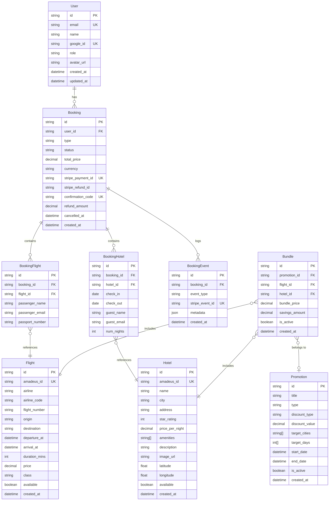

# Section 6: Database Schema

[Back to index](index.md)

---

## 6. Database Schema

### 6.1 Prisma Schema

```prisma
// packages/database/prisma/schema.prisma

generator client {
  provider = "prisma-client-js"
}

datasource db {
  provider = "postgresql"
  url      = env("DATABASE_URL")
}

enum UserRole {
  user
  admin
}

enum BookingStatus {
  pending
  confirmed
  cancelled
}

enum BookingType {
  flight
  hotel
  bundle
}

enum PromotionType {
  flight
  hotel
  bundle
}

enum DiscountType {
  percentage
  fixed_amount
}

model User {
  id            String    @id @default(cuid())
  email         String    @unique
  name          String
  google_id     String?   @unique
  role          UserRole  @default(user)
  avatar_url    String?
  created_at    DateTime  @default(now())
  updated_at    DateTime  @updatedAt

  bookings      Booking[]

  @@map("users")
}

model Flight {
  id            String    @id @default(cuid())
  amadeus_id    String    @unique
  airline       String
  airline_code  String    // IATA code: QF, VA, JQ
  flight_number String
  origin        String    // IATA airport code: SYD, MEL
  destination   String
  departure_at  DateTime
  arrival_at    DateTime
  duration_mins Int
  price         Decimal   @db.Decimal(10, 2)
  class         String    @default("economy")  // economy, business
  available     Boolean   @default(true)
  created_at    DateTime  @default(now())
  updated_at    DateTime  @updatedAt

  booking_flights BookingFlight[]
  bundles         Bundle[]

  @@index([origin, destination, departure_at])
  @@index([price])
  @@map("flights")
}

model Hotel {
  id              String    @id @default(cuid())
  amadeus_id      String    @unique
  name            String
  city            String
  address         String
  star_rating     Int       // 1-5
  price_per_night Decimal   @db.Decimal(10, 2)
  amenities       String[]  // ["wifi", "pool", "gym", "breakfast"]
  description     String?   @db.Text
  image_url       String?
  latitude        Float?
  longitude       Float?
  available       Boolean   @default(true)
  created_at      DateTime  @default(now())
  updated_at      DateTime  @updatedAt

  booking_hotels  BookingHotel[]
  bundles         Bundle[]

  @@index([city, price_per_night])
  @@map("hotels")
}

model Booking {
  id                  String        @id @default(cuid())
  user_id             String
  type                BookingType
  status              BookingStatus @default(pending)
  total_price         Decimal       @db.Decimal(10, 2)
  currency            String        @default("AUD")
  stripe_payment_id   String?       @unique
  stripe_refund_id    String?
  confirmation_code   String        @unique @default(cuid())
  cancellation_reason String?
  refund_amount       Decimal?      @db.Decimal(10, 2)
  cancelled_at        DateTime?
  created_at          DateTime      @default(now())
  updated_at          DateTime      @updatedAt

  user                User          @relation(fields: [user_id], references: [id])
  booking_flights     BookingFlight[]
  booking_hotels      BookingHotel[]
  booking_events      BookingEvent[]

  @@index([user_id])
  @@index([confirmation_code])
  @@index([stripe_payment_id])
  @@map("bookings")
}

model BookingFlight {
  id               String   @id @default(cuid())
  booking_id       String
  flight_id        String
  passenger_name   String
  passenger_email  String
  passport_number  String?
  created_at       DateTime @default(now())

  booking          Booking  @relation(fields: [booking_id], references: [id])
  flight           Flight   @relation(fields: [flight_id], references: [id])

  @@map("booking_flights")
}

model BookingHotel {
  id           String   @id @default(cuid())
  booking_id   String
  hotel_id     String
  check_in     DateTime @db.Date
  check_out    DateTime @db.Date
  guest_name   String
  guest_email  String
  num_nights   Int
  created_at   DateTime @default(now())

  booking      Booking  @relation(fields: [booking_id], references: [id])
  hotel        Hotel    @relation(fields: [hotel_id], references: [id])

  @@map("booking_hotels")
}

model BookingEvent {
  id           String   @id @default(cuid())
  booking_id   String
  event_type   String   // payment_intent.succeeded, booking.cancelled, refund.processed, etc.
  stripe_event_id String? @unique  // Idempotency key for Stripe webhook events
  metadata     Json?
  created_at   DateTime @default(now())

  booking      Booking  @relation(fields: [booking_id], references: [id])

  @@index([booking_id])
  @@index([stripe_event_id])
  @@map("booking_events")
}

model Promotion {
  id              String        @id @default(cuid())
  title           String
  description     String?
  type            PromotionType
  discount_type   DiscountType
  discount_value  Decimal       @db.Decimal(10, 2)  // % or AUD amount
  target_cities   String[]      // ["SYD", "MEL"] — empty = all cities
  target_days     Int[]         // [5, 6, 7] = Fri, Sat, Sun (1=Mon, 7=Sun)
  image_url       String?
  start_date      DateTime
  end_date        DateTime
  is_active       Boolean       @default(true)
  created_at      DateTime      @default(now())
  updated_at      DateTime      @updatedAt

  bundles         Bundle[]

  @@index([is_active, start_date, end_date])
  @@map("promotions")
}

model Bundle {
  id              String    @id @default(cuid())
  promotion_id    String?
  flight_id       String
  hotel_id        String
  bundle_price    Decimal   @db.Decimal(10, 2)
  savings_amount  Decimal   @db.Decimal(10, 2)  // Individual - bundle price
  is_active       Boolean   @default(true)
  created_at      DateTime  @default(now())
  updated_at      DateTime  @updatedAt

  promotion       Promotion? @relation(fields: [promotion_id], references: [id])
  flight          Flight     @relation(fields: [flight_id], references: [id])
  hotel           Hotel      @relation(fields: [hotel_id], references: [id])

  @@map("bundles")
}
```

### 6.2 Entity-Relationship Diagram


