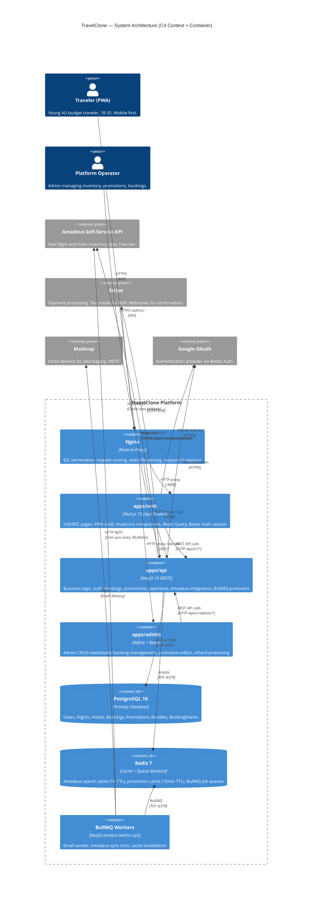
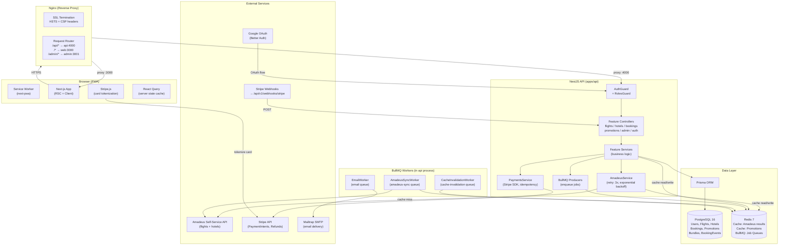

# Section 7: System Architecture Diagrams

[Back to index](index.md)

---

## 7. System Architecture Diagram

```mermaid
C4Context
    title TravelClone — System Architecture (C4 Context + Container)

    Person(traveler, "Traveler (PWA)", "Young AU budget traveler, 18-35. Mobile-first.")
    Person(admin, "Platform Operator", "Admin managing inventory, promotions, bookings.")

    System_Boundary(travelclone, "TravelClone Platform") {
        Container(nginx, "Nginx", "Reverse Proxy", "SSL termination, request routing, static file serving, request-id injection")

        Container(web, "apps/web", "Next.js 15 (App Router)", "SSR/RSC pages, PWA shell, shadcn/ui components, React Query, Better Auth session")

        Container(api, "apps/api", "NestJS 10 (REST)", "Business logic, auth, bookings, promotions, payments, Amadeus integration, BullMQ producers")

        Container(adminApp, "apps/admin", "Refine + React", "Admin CRUD dashboard, booking management, promotion editor, refund processing")

        ContainerDb(postgres, "PostgreSQL 16", "Primary Database", "Users, Flights, Hotels, Bookings, Promotions, Bundles, BookingEvents")

        ContainerDb(redis, "Redis 7", "Cache + Queue Backend", "Amadeus search cache (1h TTL), promotion cache (15min TTL), BullMQ job queues")

        Container(workers, "BullMQ Workers", "NestJS workers (within api)", "Email sender, Amadeus sync cron, cache invalidation")
    }

    System_Ext(amadeus, "Amadeus Self-Service API", "Real flight and hotel inventory data. Free tier.")
    System_Ext(stripe, "Stripe", "Payment processing. Test mode for MVP. Webhooks for confirmation.")
    System_Ext(mailtrap, "Mailtrap", "Email delivery for dev/staging. SMTP.")
    System_Ext(google, "Google OAuth", "Authentication provider via Better Auth.")

    Rel(traveler, nginx, "HTTPS", "443")
    Rel(admin, nginx, "HTTPS /admin/", "443")

    Rel(nginx, web, "HTTP proxy", ":3000")
    Rel(nginx, api, "HTTP proxy /api/", ":4000")
    Rel(nginx, adminApp, "HTTP proxy /admin/", ":3001")

    Rel(web, api, "REST API calls", "HTTP /api/v1/*")
    Rel(adminApp, api, "REST API calls", "HTTP /api/v1/admin/*")

    Rel(api, postgres, "Prisma ORM", "TCP :5432")
    Rel(api, redis, "ioredis", "TCP :6379")
    Rel(workers, redis, "BullMQ", "TCP :6379")

    Rel(workers, amadeus, "HTTP REST", "Cron sync every 30-60min")
    Rel(api, amadeus, "HTTP REST", "Cache miss fallback")
    Rel(api, stripe, "Stripe SDK", "PaymentIntent create/confirm")
    Rel(stripe, api, "Webhook POST", "HTTPS /api/v1/webhooks/stripe")
    Rel(workers, mailtrap, "SMTP", "Email delivery")
    Rel(web, google, "OAuth redirect", "HTTPS")
    Rel(api, google, "Token validation", "HTTPS")
```

**Component-level flow diagram:**

```mermaid
flowchart TD
    subgraph Browser["Browser (PWA)"]
        SW["Service Worker\n(next-pwa)"]
        ReactApp["Next.js App\n(RSC + Client)"]
        StripeJS["Stripe.js\n(card tokenization)"]
        RQ["React Query\n(server state cache)"]
    end

    subgraph NginxProxy["Nginx (Reverse Proxy)"]
        SSL["SSL Termination\nHSTS + CSP headers"]
        Router["Request Router\n/api/* → api:4000\n/* → web:3000\n/admin/* → admin:3001"]
    end

    subgraph NestAPI["NestJS API (apps/api)"]
        AuthGuard["AuthGuard\n+ RolesGuard"]
        Controllers["Feature Controllers\nflights / hotels / bookings\npromotions / admin / auth"]
        Services["Feature Services\n(business logic)"]
        AmadeusService["AmadeusService\n(retry: 3x, exponential backoff)"]
        PaymentsService["PaymentsService\n(Stripe SDK, idempotency)"]
        BullMQProducer["BullMQ Producers\n(enqueue jobs)"]
    end

    subgraph DataLayer["Data Layer"]
        Prisma["Prisma ORM"]
        PG[("PostgreSQL 16\nUsers, Flights, Hotels\nBookings, Promotions\nBundles, BookingEvents")]
        RedisCache[("Redis 7\nCache: Amadeus results\nCache: Promotions\nBullMQ: Job Queues")]
    end

    subgraph Workers["BullMQ Workers (in api process)"]
        EmailWorker["EmailWorker\n(email queue)"]
        SyncWorker["AmadeusSyncWorker\n(amadeus-sync queue)"]
        CacheWorker["CacheInvalidationWorker\n(cache-invalidation queue)"]
    end

    subgraph ExternalServices["External Services"]
        AmadeusAPI["Amadeus Self-Service API\n(flights + hotels)"]
        StripeAPI["Stripe API\n(PaymentIntents, Refunds)"]
        StripeWebhook["Stripe Webhooks\n→ /api/v1/webhooks/stripe"]
        Mailtrap["Mailtrap SMTP\n(email delivery)"]
        GoogleOAuth["Google OAuth\n(Better Auth)"]
    end

    ReactApp -->|HTTPS| NginxProxy
    NginxProxy -->|proxy :3000| ReactApp
    NginxProxy -->|proxy :4000| AuthGuard
    AuthGuard --> Controllers
    Controllers --> Services
    Services --> AmadeusService
    Services --> PaymentsService
    Services --> BullMQProducer
    Services --> Prisma
    Prisma --> PG
    AmadeusService -->|cache miss| AmadeusAPI
    AmadeusService -->|cache read/write| RedisCache
    Services -->|cache read/write| RedisCache
    BullMQProducer --> RedisCache
    EmailWorker --> Mailtrap
    SyncWorker --> AmadeusAPI
    SyncWorker --> RedisCache
    CacheWorker --> RedisCache
    PaymentsService --> StripeAPI
    StripeWebhook -->|POST| Controllers
    StripeJS -->|tokenize card| StripeAPI
    GoogleOAuth -->|OAuth flow| AuthGuard
```
